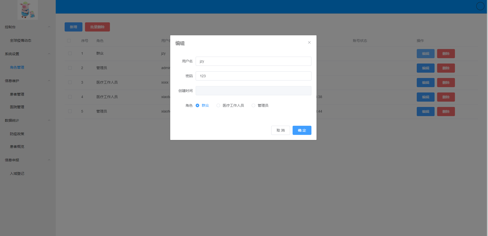
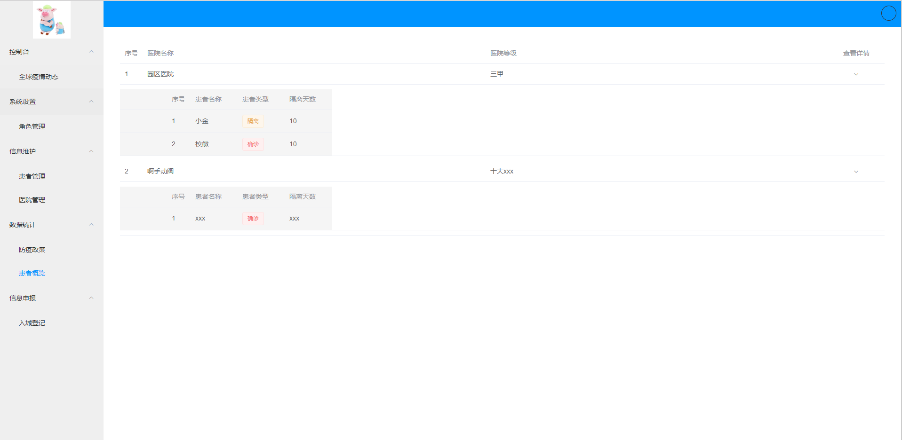
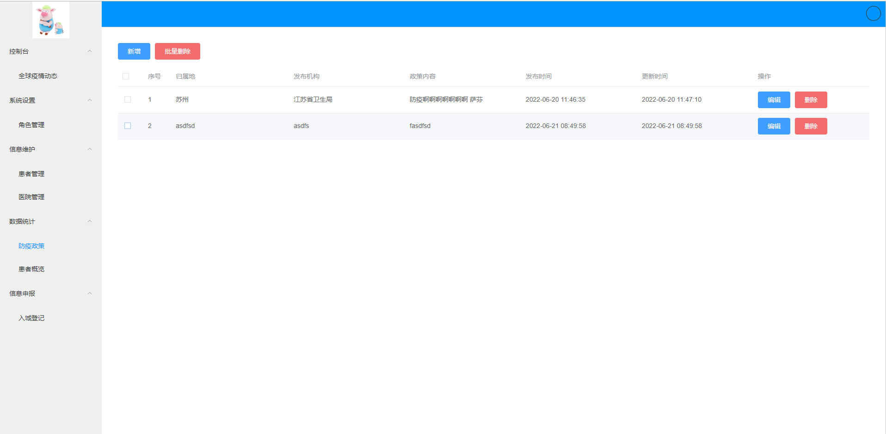
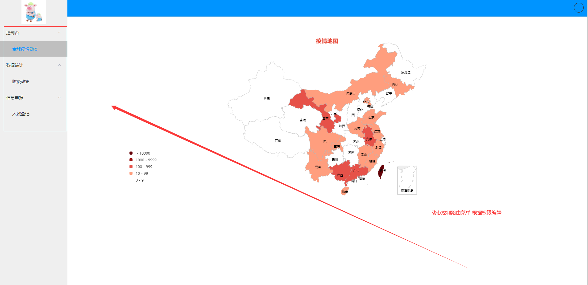
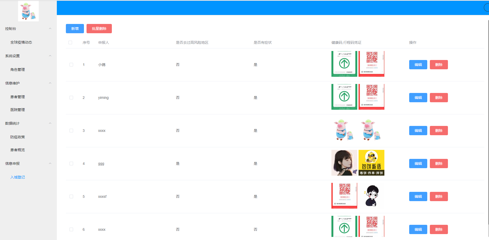
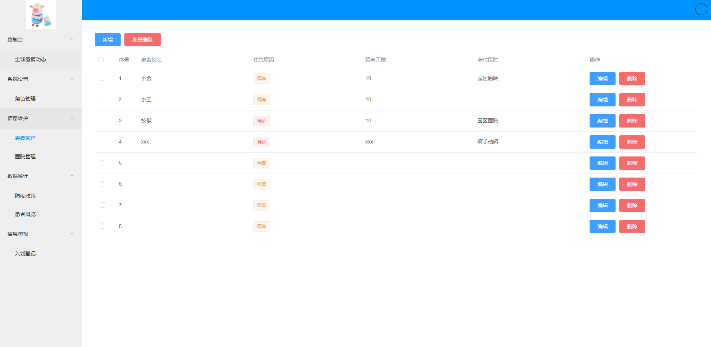
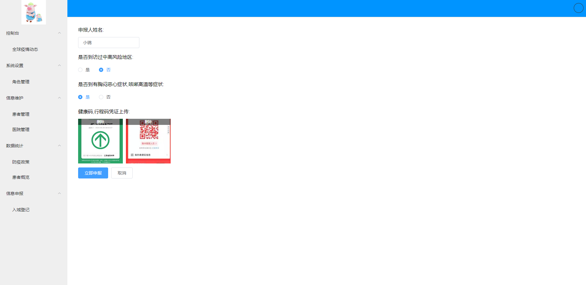

# front

## Project setup

```
npm install
npm run serve
```
<!-- 项目简介 -->
毕业设计案例
vue+express+mysql 前后分离疫情管理完整版
electron支持PC端应用.exe程序(有安装包可分享他人)，支持网页端网站展示
功能:全国疫情展示,地图(真实数据)、角色管理、权限管理、患者管理、医院管理、防疫政策、患者概览、信息申报
功能大体包含:图片上传,单表增删改查，批量删除，多表关联查询，echarts地图可视化,树形数据处理,根据角色动态分配路由,权限控制..
(50米)

<!-- 项目示例图 -->









